  Amazon SageMaker Workshop                              if ( $.cookie('styleCookie') === 'style-light.css') { $('html, body').css('background', '#eeeeee'); } else if ($.cookie('styleCookie') === 'style.css') { $('html, body').css('background', '#222222'); }                     

  Lab 2:  
Anomaly Detection with Random Cut Forest
===================================================

Step 1
------

Setting Up S3

This second lab demonstrates how you can use the Random Cut Forest Amazon provided algorithm.

First download the following starting notebook:  
[random\_cut\_forest.ipynb](random_cut_forest.ipynb)

After downloading, open up the Jupyter Notebook that we created in Lab1 of the workshop.

Select ‘Upload’ and upload the downloaded notebook file. Then open the file to edit and run it.

**IMPORTANT:**  
Replace the S3Bucket location with a bucket you created in the Lab1 of the workshop  

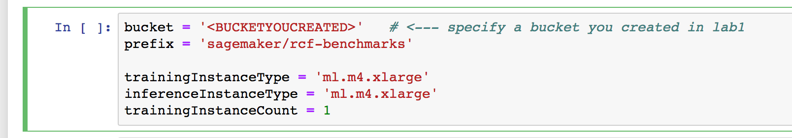

AFTER replacing the bucket location Run the first two cells  
You should see a message indicating where the S3 location being used is:

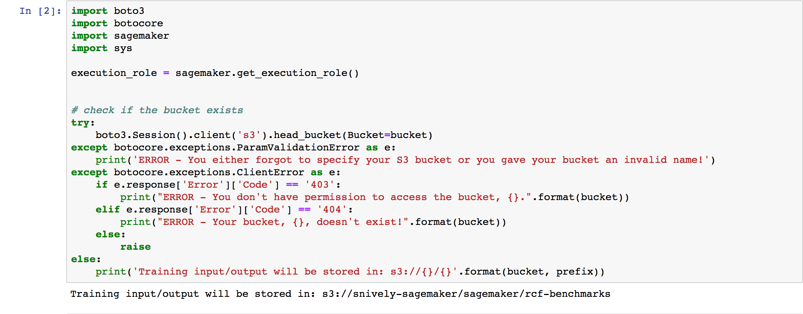

Step 2
------

Act 1 - Data download and exploration

Run through the data exploration cells in Act 1:  
Let's begin exploring the data.

Look at the data, can you start seeing any anomalies as we bin the data in diferent catagories  
Can you start to see any in the plots or table views?

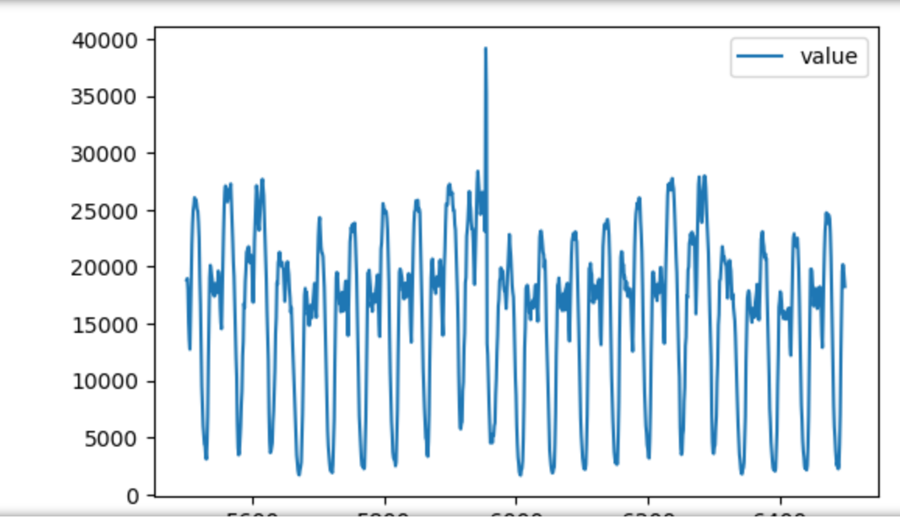

One spike stands out...but there are likely more than that in this dataset...

Step 3
------

Act 2 - Training the Random Cut Forest

Go ahead and tep through Act 2 - training the model Take a look at the instance type and count. Notice that we can use different types and instances This process takes approximately 5 minutes to train. it's normal to see this type of output:

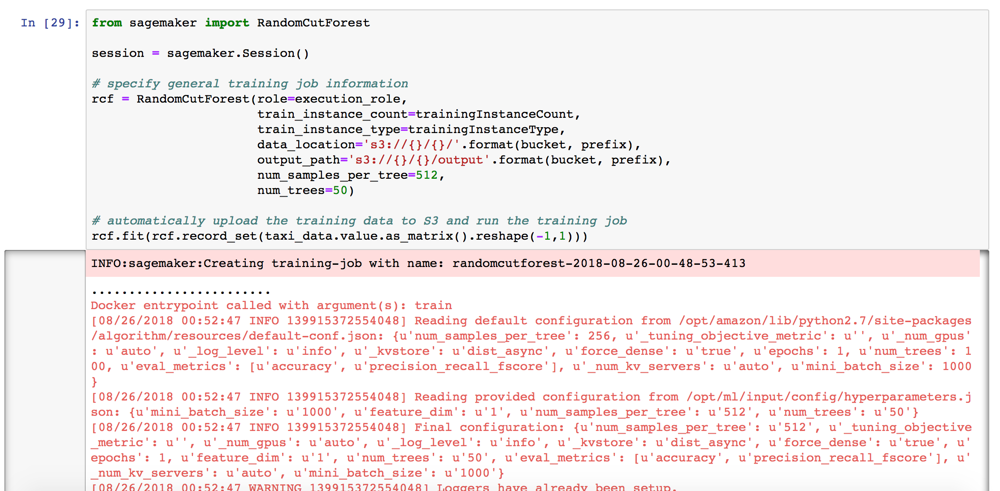

When it's done, you can execute the next cell and see the details here:

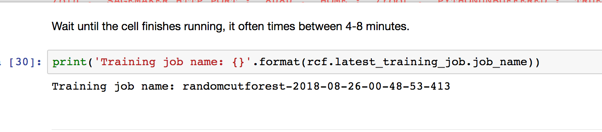

Step 4
------

Act 3 - Inferencing and Evluatingt

Create the endpoint to and run through the act 3 cells. Take a look at the anomaly score for some of the datapoints:

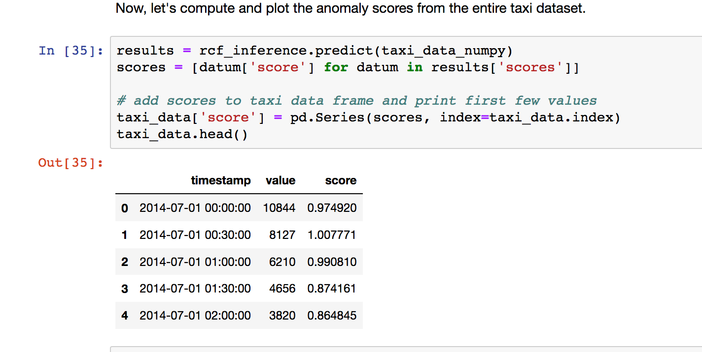

We can also examine the visual of the chart for the score over time:

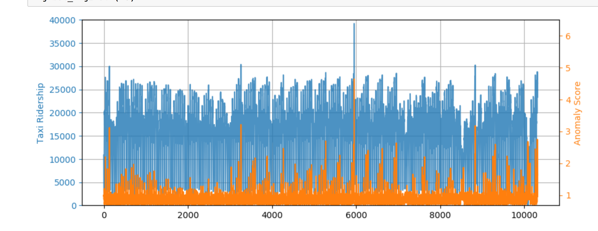

Lets now look at more of the dataset:

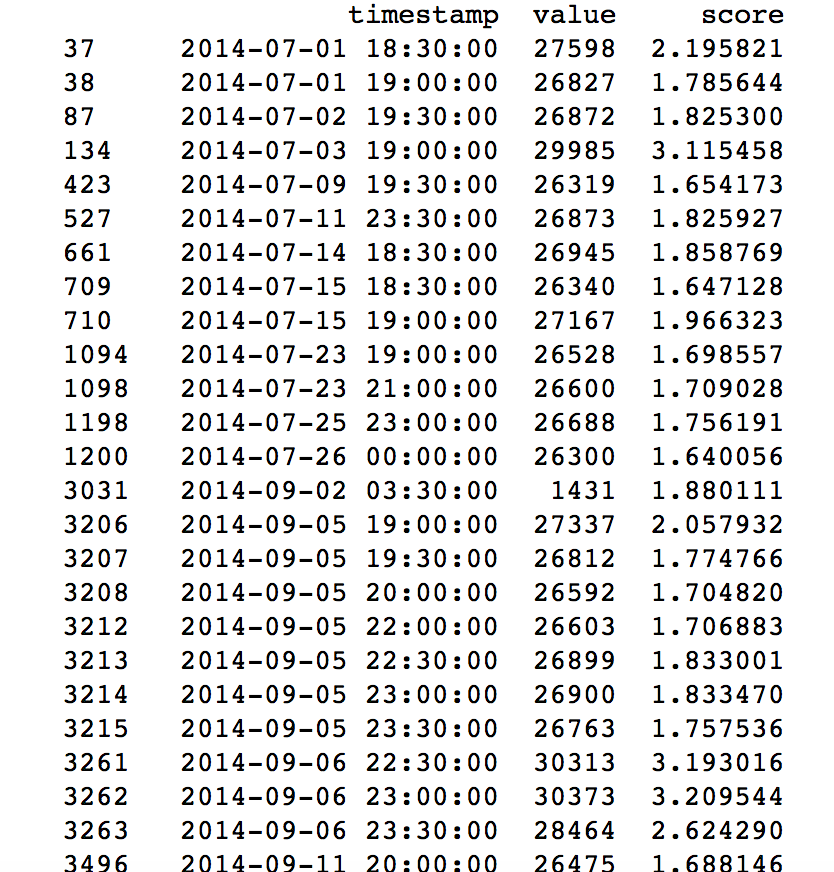

Lastly, let's plot the points differently:

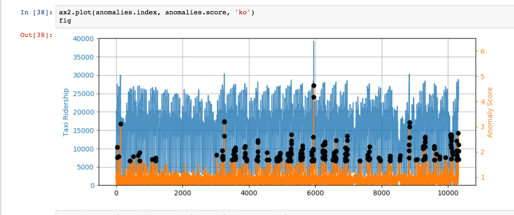

Step 5
------

Act 4 - Shingling to improve the model

Another improvement is make use of a windowing technique called "shingling".¶ This is especially useful when working with periodic data with known period, such as the NYC taxi dataset used above. The idea is to treat a period of PP datapoints as a single datapoint of feature length PP and then run the RCF algorithm on these feature vectors. That is, if our original data consists of points x1,x2,…,xN∈ℝx1,x2,…,xN∈R then we perform the transformation, Let's shingle the data per day.

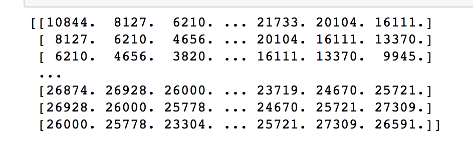

Run the new training job

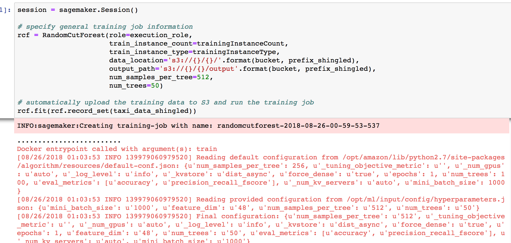

Step through the rest of the cells -- but take special attention to the results now:

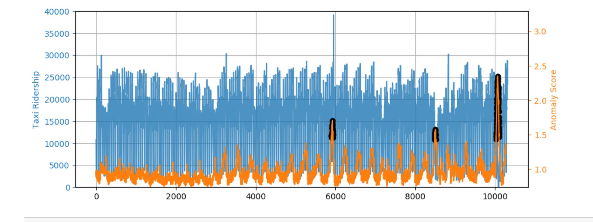

© 2018, Amazon Web Services, Inc. or its affiliates. All rights reserved.
