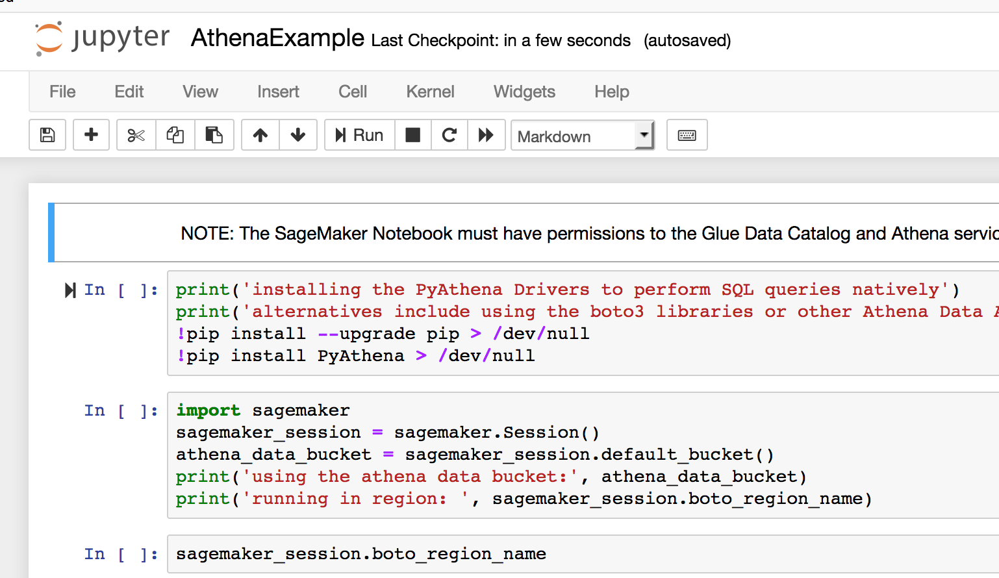
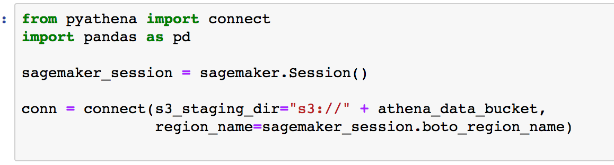
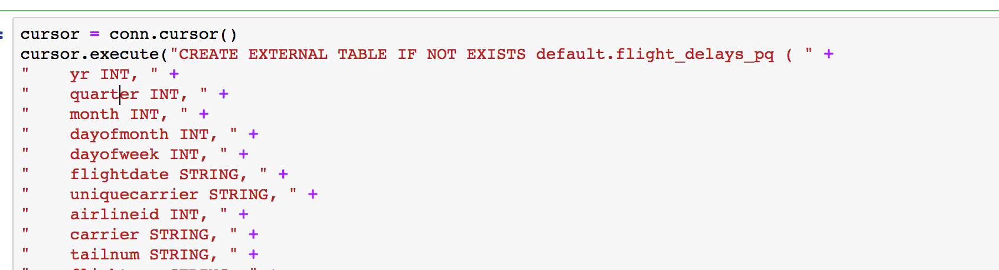
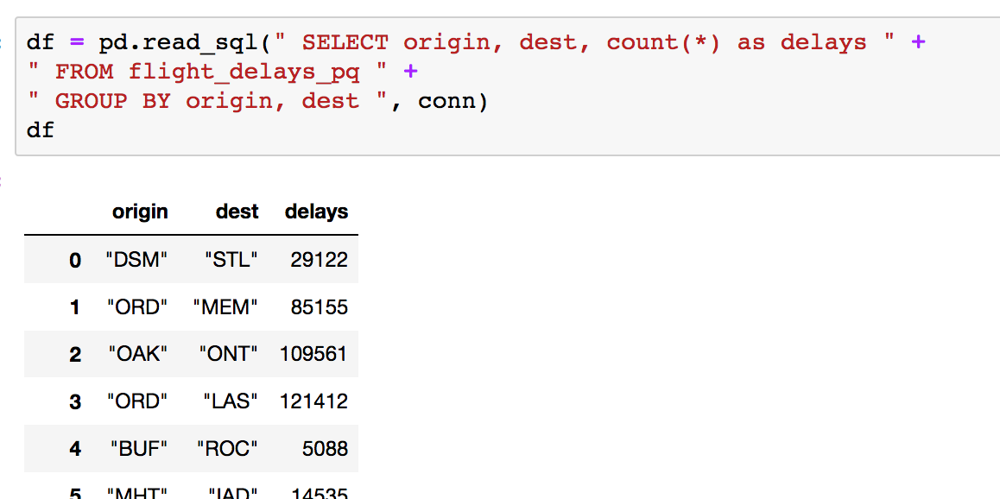
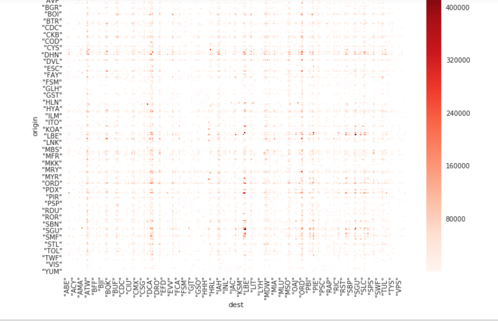

  Amazon SageMaker Workshop                              if ( $.cookie('styleCookie') === 'style-light.css') { $('html, body').css('background', '#eeeeee'); } else if ($.cookie('styleCookie') === 'style.css') { $('html, body').css('background', '#222222'); }                     

  Lab 4:  
Integrating with AWS Services (Athena)
=================================================

Step 1
------

Introduction

In this section, we'll show how to start integrating with various Services.

Step 2
------

Integrating with Athena

1.  Select the IntegratingWithServices/AthenaExample.ipynb notebook
    
    
    
2.  this will laumnch the notebook that has the athena exmaple. In this notebook we'll create the table in the Glue catalog. Ideally this would have be done through Glue, Lake Formation or another method. We wanted this to be a self contained notebook though.
    
    
    
3.  This first cell will load pyathena  
    [https://pypi.org/project/PyAthena/](https://pypi.org/project/PyAthena/)
    
    
    
4.  Athena needs a S3 bucket location and a region setting when making the connection.  
    Rather than hard coding these, we are going to pull them from the sagemaker session.
    
    
    
5.  Next we'll create a connection object
    
    
    
6.  We'll create a flights table
    
    
    
7.  This command is necessary because we did the create table ourselves and it's partitioned in S3. This discovers the partitions in the catalog
    
    
    
8.  We can directly load our pandas dataframe now from Athena:
    
    
    
9.  Let's create a seaborn heatmap based on delays per departing and arriving airport:
    
    
    

© 2018, Amazon Web Services, Inc. or its affiliates. All rights reserved.
