   Amazon SageMaker Workshop                              if ( $.cookie('styleCookie') === 'style-light.css') { $('html, body').css('background', '#eeeeee'); } else if ($.cookie('styleCookie') === 'style.css') { $('html, body').css('background', '#222222'); }                     

  Lab 3:  
KMeans Clustering
============================

Step 1
------

Introduction

K-means is an unsupervised learning algorithm. It attempts to find discrete groupings within data, where members of a group are as similar as possible to one another and as different as possible from members of other groups. You define the attributes that you want the algorithm to use to determine similarity. Amazon SageMaker uses a modified version of the web-scale k-means clustering algorithm. Compared with the original version of the algorithm, the version used by Amazon SageMaker is more accurate. Like the original algorithm, it scales to massive datasets and delivers improvements in training time. To do this, the version used by Amazon SageMaker streams mini-batches (small, random subsets) of the training data. For more information about mini-batch k-means, see Web-scale k-means Clustering.

Step 2
------

Loading the Notebook

1.  Download the base notebook: [KMeansOfCrimeData.ipynb](KMeansOfCrimeData.ipynb)
2.  Open the notebook instance and upload the notebook
3.  First set the S3 bucket that you created in Lab1

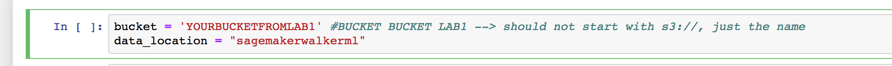

5.  Let's load the data and look at it:  
    Run the next cell to download the dataset to the notebook  
    Look at the two datasets we have here.  
    (1) The Crime data include state and crime stats  
    (2) The Density data include state and density numbers  
    
    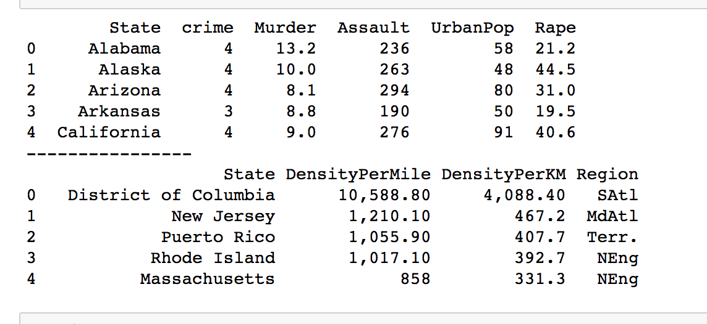
    
6.  Since we have mixed numerical values that really are different units and scales  
    The scale on the density is much greater than the scale of our other features.  
    Let's scale it back to between -1 and 1:
    
    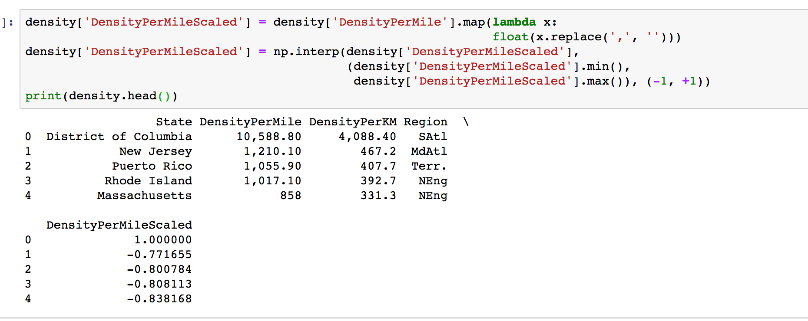
    
7.  Let's join this dataset together next so we can cluster on the combined fields
    
    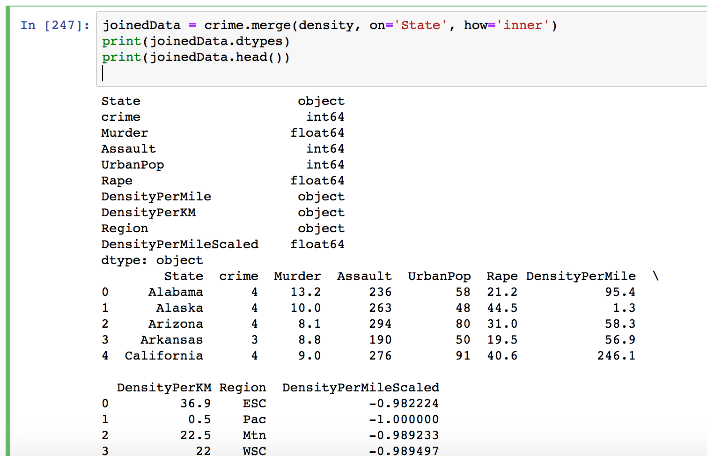
    
8.  In the next section, we'll do the following  
    First we'll create an array of floats. These are the values used in the clustering algorithms  
    Next we'll check the dimension, or shape, of the values. Not surprising it's 50 since it's per state and we see 5 features  
    Last, we print the values to look at them...  
    
    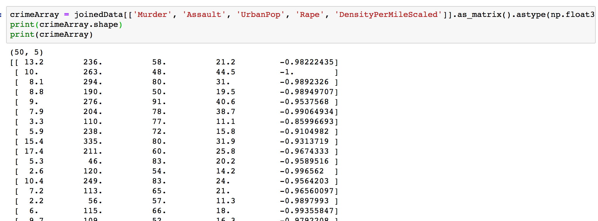
    

Step 3
------

Training the KMeans Cluster

1.  Run the next cell to setup the kmean training information  
    Take special attention to the Hyperparamters...
    
    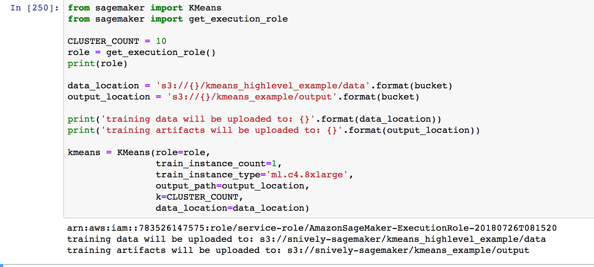
    
      
    **Important:** Notice how we are using the **from sagemaker import KMeans** rather than a container in this example  
    This is using the SageMaker SDK libraries.
2.  Run the KMeans fit method to train the model
    
    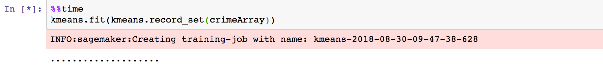
    
    After a few minutes, you'll see the build process to start:
    
    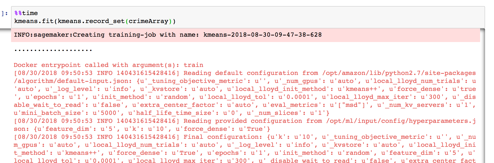
    
3.  After the model is built, notice how the wall time and bill time is different.  
    You aren't charged startup costs for the cluster.
    
    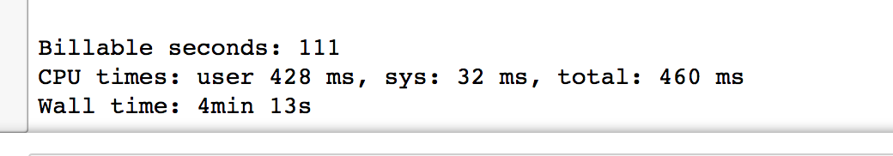
    

Step 4
------

Deploying the model endpoint

1.  Deploy the model. This can take a few minutes...
    
    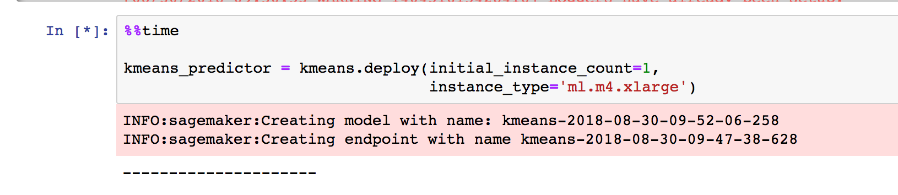
    
    In this example, the endpoint took 5 minutes to come up:
    
    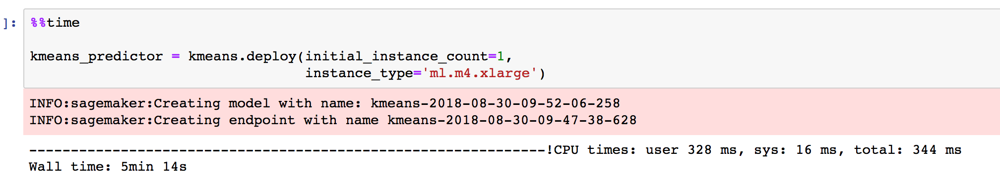
    
2.  Let's run some predictions and look at the results
    
    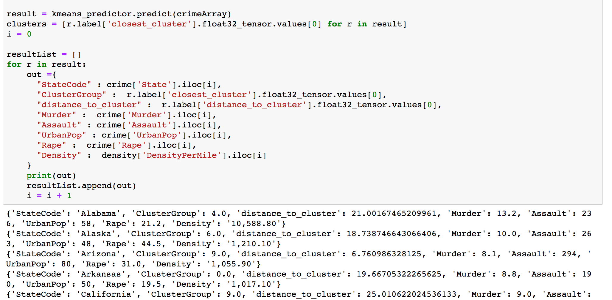
    
3.  Sort by cluster group and the distance from the cluster center or cluster mean:
    
    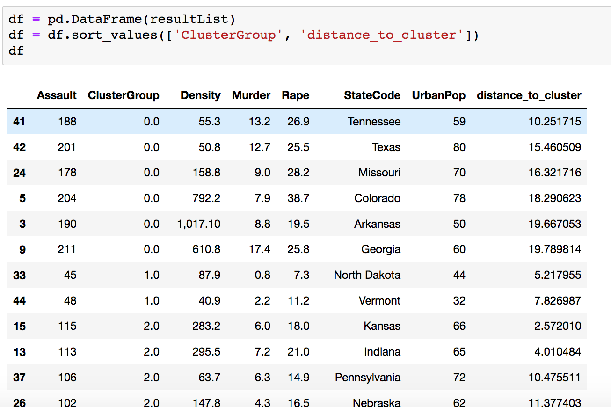
    
4.  Lastly, we'll show the distribution of data across each cluster:
    
    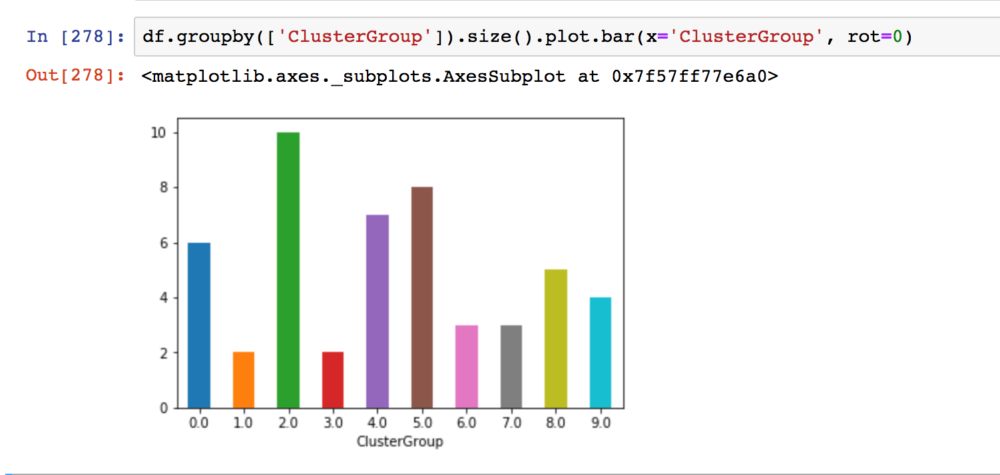
    
    This shows us how large each cluster is (assuming we assign the data point to the closest cluster...)

© 2018, Amazon Web Services, Inc. or its affiliates. All rights reserved.
