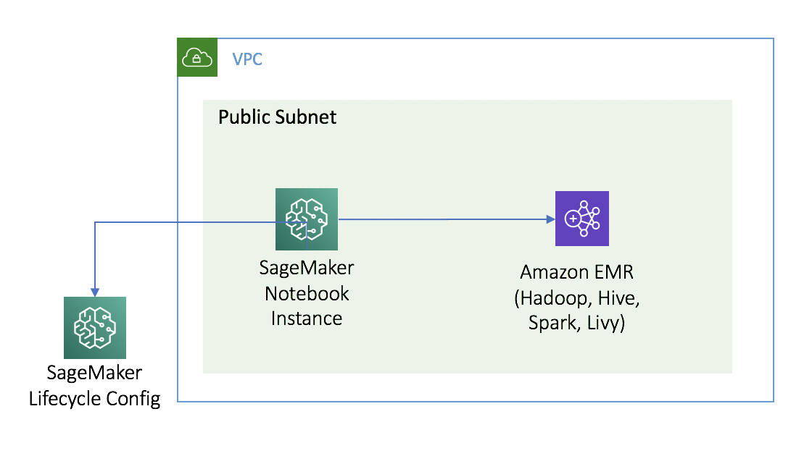
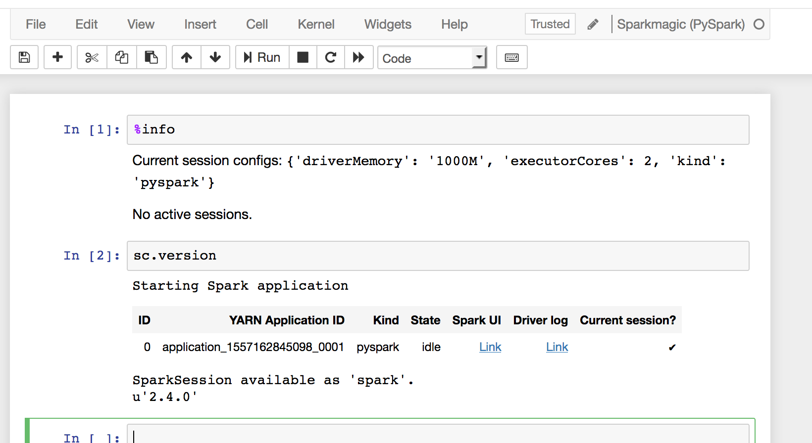
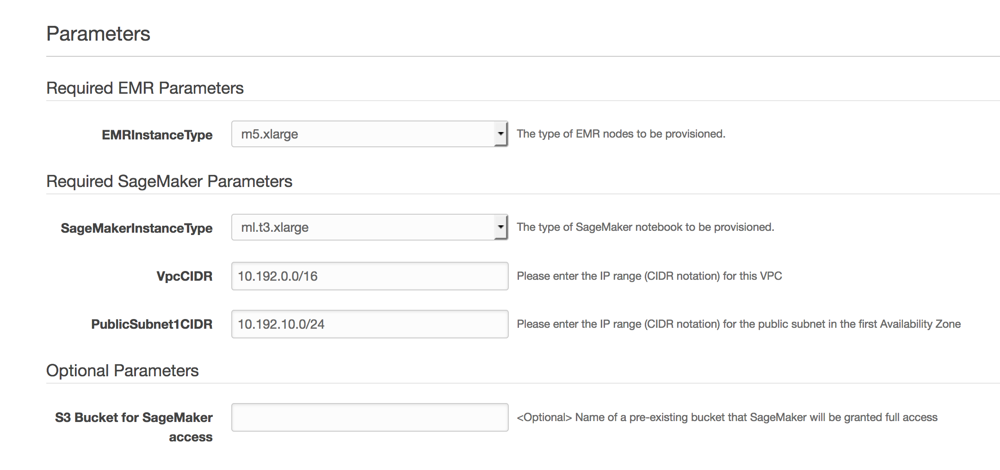

SageMaker/EMR Integration CloudFormation Template:
--------------------------------------------------

Important Pre-requisite:
^^^^^^^^^^^^^^^^^^^^^^^^

This solution relies on the default roles are already created for EMR.   If you haven't created these or launched a cluster in the past, you can do this in a single line call via the CLI:
https://docs.aws.amazon.com/cli/latest/reference/emr/create-default-roles.html

if using the default profile:

.. code-block:: sh

   aws emr create-default-roles

specifying a different CLI profile:

.. code-block:: sh

   aws emr create-default-roles --profile my_other_profile

If this has been run in the past, there will be an empty [] return.
If it hasn't been run before, you will see the IAM roles have been created:

.. code-block:: json

   [
       {
           "Role": {
               "Path": "/",
               "RoleName": "EMR_EC2_DefaultRole",
               "RoleId": "ASDJALDSJFASDFASDF",
               "Arn": "arn:aws:iam::1111111111:role/EMR_EC2_DefaultRole",
               "CreateDate": "2019-05-21T17:42:52Z",
               "AssumeRolePolicyDocument": {
                   "Version": "2008-10-17",
                   "Statement": [
                       {
                           "Sid": "",
                           "Effect": "Allow",
                           "Principal": {

(rest of result omitted)

Overview:
^^^^^^^^^

This contains a AWS CloudFormation Template that creates the following artifacts:

* New VPC with a Single Public Subnet
* EMR Cluster running (Hadoop, Hive, Spark, Livy)

  * Configurations:

    * 24 Hour Livy Timeout
    * Spark Maximum Resource Allocation

* SageMaker

  * Lifecycle Configuration configuring SparkMagic to Cluster
  * Notebook Instance

The following Diagram shows what gets created:

After running, you can use the Spark Kernels to interact w/ the EMR cluster:

The following is what is used to create the config on the notebook through the lifecycle configuration:

.. code-block:: sh

   set -e
   cd /home/ec2-user/.sparkmagic
   wget https://raw.githubusercontent.com/jupyter-incubator/sparkmagic/master/sparkmagic/example_config.json
   sed s/localhost/`aws emr list-instances --cluster-id ${EMR_CLUSTER_ID} --instance-group-types MASTER --query Instances[0].PrivateIpAddress --output text`/g example_config.json > config.json

To launch the template, you provide the following parameters:

