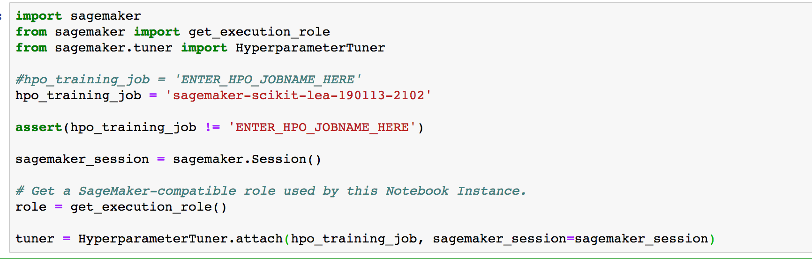
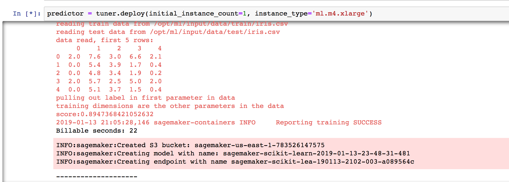
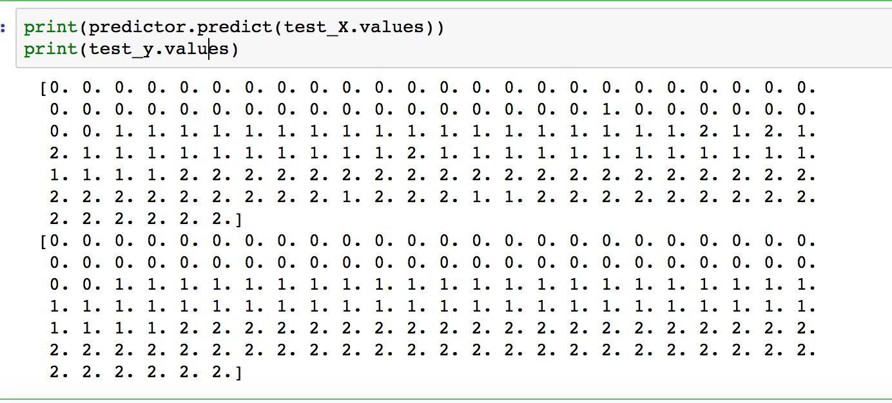
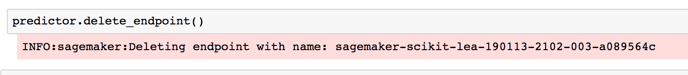

Amazon SageMaker Workshop                              if ( $.cookie('styleCookie') === 'style-light.css') { $('html, body').css('background', '#eeeeee'); } else if ($.cookie('styleCookie') === 'style.css') { $('html, body').css('background', '#222222'); }                     

Realtime Inferencing from the SciKit HPO Job
=======================================================

Step 1
------

Introduction

In this section, we'll take the best training job from HPO and deploy a realtime endpoint.

Step 2
------

Deploying our endpoint

1.  Select the 004\_RealtimeInferencinginSageMaker.ipynb notebook
2.  **IMPORTANT: fill in the HPO Job name. The screenshot shows an example filled in. you want to replace the ENTER\_HPO\_JOBNAME\_HERE with your HPO job name

  

  **
***   Next we'll deploy the endpoint from the HPO Tuning Job object

  

  **This can take a few minutes to deploy**
*   Next cell reads in some sample data to predict on
*   Next we'll compare our predictions against the actual values:

  

*   Let's delete our realtime endpoint

  
  **

**

© 2018, Amazon Web Services, Inc. or its affiliates. All rights reserved.

**
