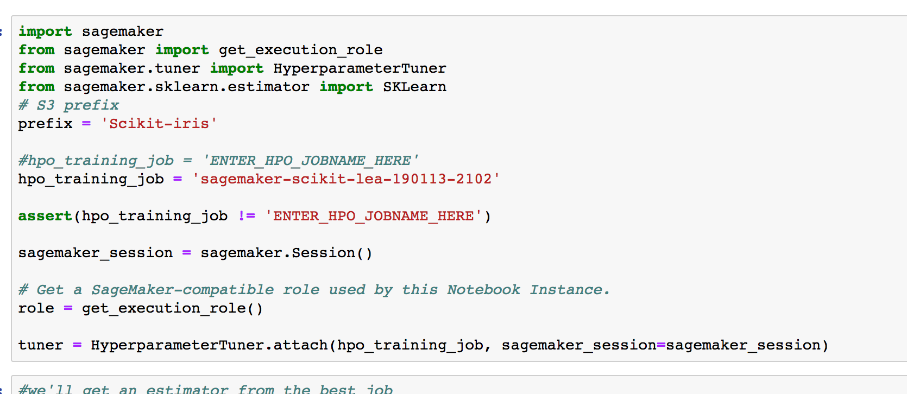
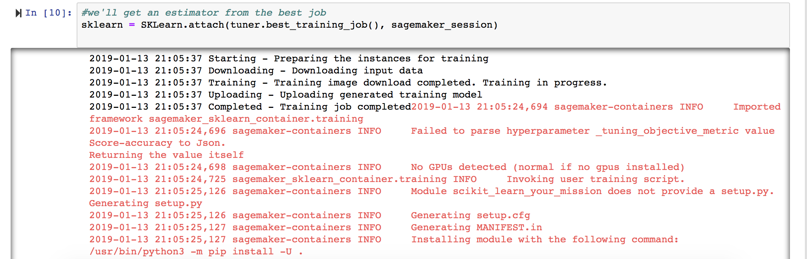
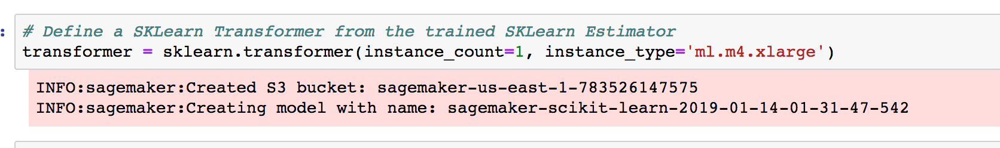
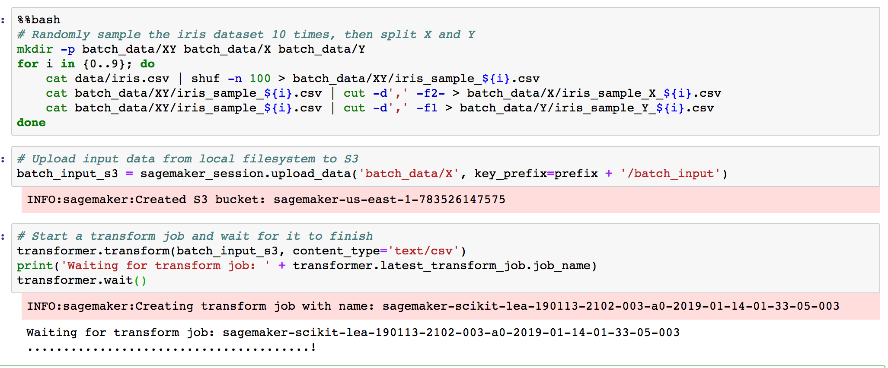
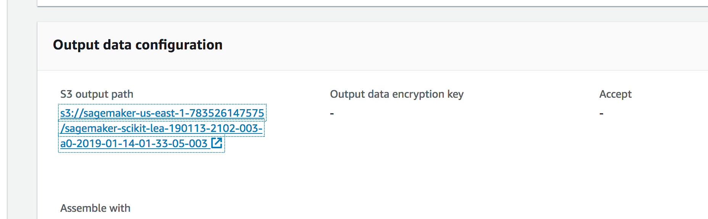
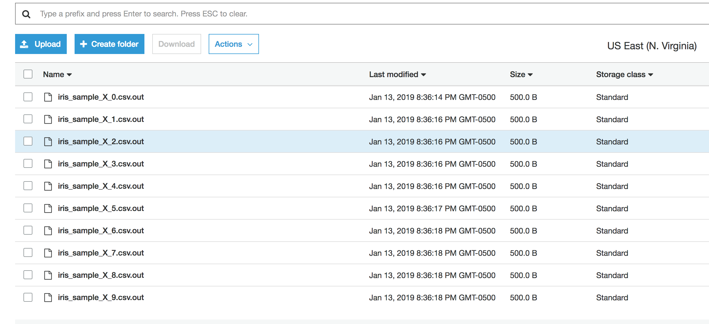
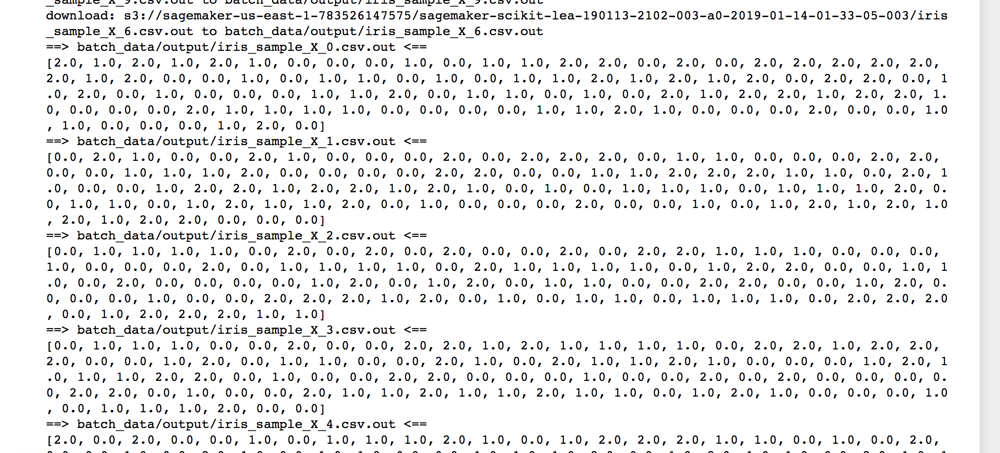

Amazon SageMaker Workshop                              if ( $.cookie('styleCookie') === 'style-light.css') { $('html, body').css('background', '#eeeeee'); } else if ($.cookie('styleCookie') === 'style.css') { $('html, body').css('background', '#222222'); }                     

Lab 5:  
Batch Inferencing from the SciKit HPO Job
====================================================

Step 1
------

Introduction

In this section, we'll take the best training job from HPO and perform batch inferencing using the model

Step 2
------

Deploying our endpoint

1.  Select the 05\_BatchInferencinginSageMaker.ipynb notebook
2.  **IMPORTANT: fill in the HPO Job name. The screenshot shows an example filled in. you want to replace the ENTER\_HPO\_JOBNAME\_HERE with your HPO job name

  

  **
***   From the HPO configuration, we can attach the SKLearn estimator using the sagemaker session and job name.

  

  **This can take a few minutes to deploy**
*   Next we create our transformer

  

*   In the next 3 cells, we'll create some sample data, upload them to S3, and start our batch transformation job:

  

  You can also go in sagemaker console and look under batch transform jobs to see the job there

  

*   When the job finishes, look in the console at the details of the job and click the link to see the output results:

  

  This will bring you into S3 where the results are:

  

*   Let's continue in the notebook  
  Run the next two cells to see the batch results

  
  **

**

© 2018, Amazon Web Services, Inc. or its affiliates. All rights reserved.
