.. role:: raw-html-m2r(raw)
   :format: html

  Amazon SageMaker Workshop                              if ( $.cookie('styleCookie') === 'style-light.css') { $('html, body').css('background', '#eeeeee'); } else if ($.cookie('styleCookie') === 'style.css') { $('html, body').css('background', '#222222'); }                     

.. image:: images/aws_logo.png
   :target: images/aws_logo.png
   :alt: 

  Lab 1/2:  

Tensorflow/Tensorboard training and HPO on SageMaker
====================================================

Step 1
------

ResNet CIFAR-10 with TensorFlow and TensorBoard

This notebook shows how to use TensorBoard, and how the training job writes checkpoints to a external bucket. The model used for this notebook is a RestNet model, trained with the CIFAR-10 dataset. See the following papers for more background:

* `Deep Residual Learning for Image Recognition <https://arxiv.org/pdf/1512.03385.pdf>`_ by Kaiming He, Xiangyu Zhang, Shaoqing Ren, and Jian Sun, Dec 2015.
* `Identity Mappings in Deep Residual Networks <https://arxiv.org/pdf/1603.05027.pdf>`_ by Kaiming He, Xiangyu Zhang, Shaoqing Ren, and Jian Sun, Jul 2016.

Browse the following location:

TensorFlowImmersionLabs/TensorFlowWithTensorBoardLabs.ipynb

.. image:: images/lab1/pic1.png
   :target: images/lab1/pic1.png
   :alt: 

Select the TensorFlowWithTensorBoardLabs.ipynb” link to launch the notebook in the new tab.

You should see this:

.. image:: images/lab1/pic2.png
   :target: images/lab1/pic2.png
   :alt: 

Step through the notebook until the training starts. until this point:

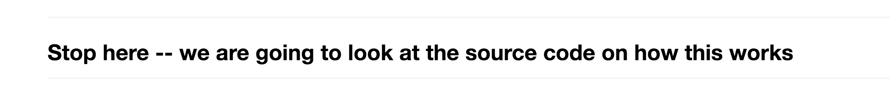

Now let's go into the source code for Tensorflow and look at how it's working

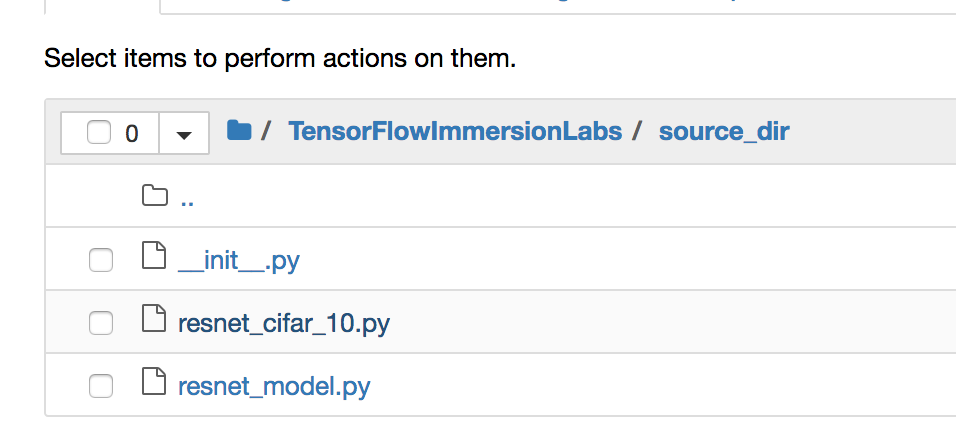

Slick on the resnet_cifar_10.py script

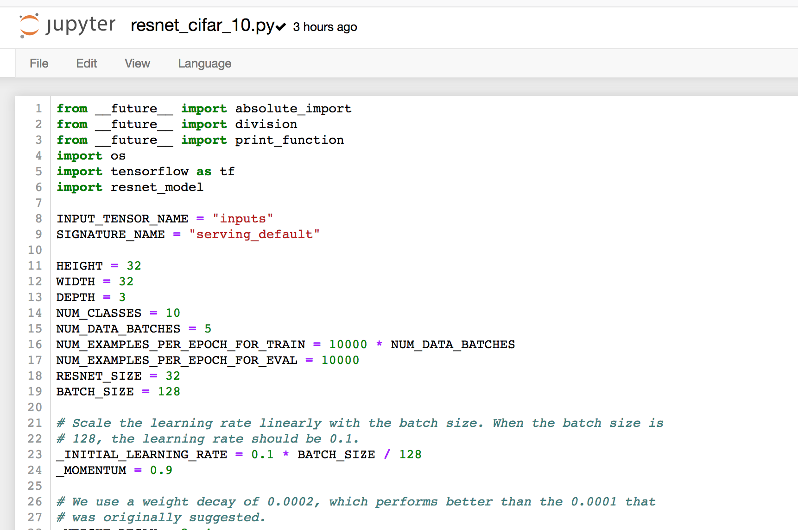

**This is how it works w/ the 'Legacy' mode for TensorFlow. We'll step through the 'Script' mode later in the workshop**  

The **Legacy mode** training script must contain the following:

* Exactly one of the following:

  * model_fn: defines the model that will be trained.
  * keras_model_fn: defines the tf.keras model that will be trained.
  * estimator_fn: defines the tf.estimator.Estimator that will train the model.

* train_input_fn: preprocess and load training data.
* eval_input_fn: preprocess and load evaluation data.
* OPTIONAL:serving_input_fn

Let's take a look at the model_fn function: Scroll down and look through the function. Take special note of the part circled below. This is where we are taking in the hyperparameters from the Tensorflow Container. We'll also use this in the HPO.

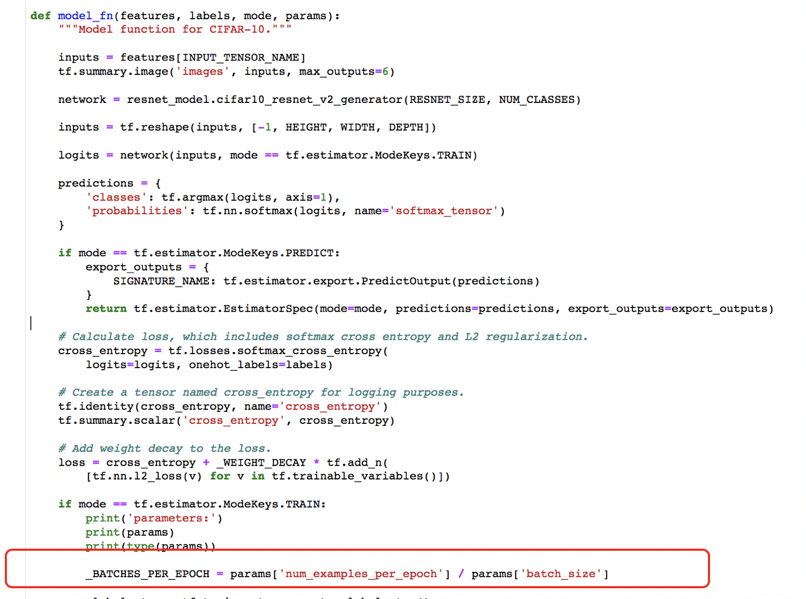

Switch back to the jupyter notebook and run the training script\ :raw-html-m2r:` `
: You’ll notice that the training takes in the Tensorflow scripts as input:

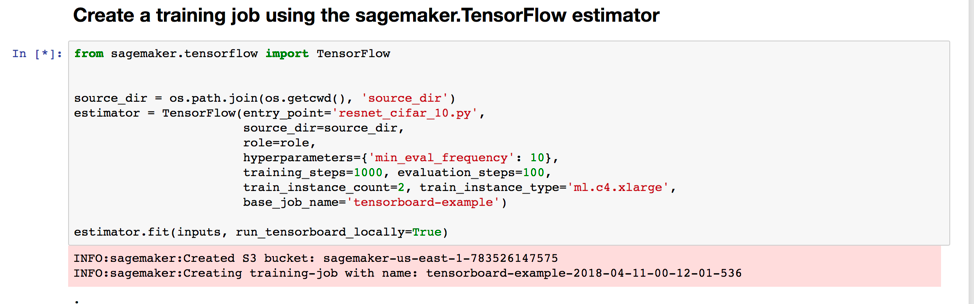

As it’s training, we can check the TensorBoard running through the notebook. It may take a few minutes for the training cycles to start sending ata to TensorBoard...

When you see this:

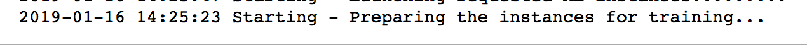

Then you can click this proxy link:\ :raw-html-m2r:` `
**IMPORTANT: Use the proxy/6006/ link and not the localhost link**

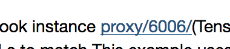

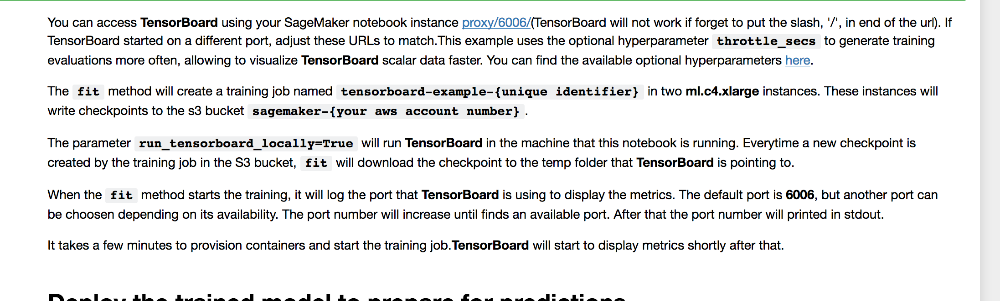

That will launch the TensorBoard UI:

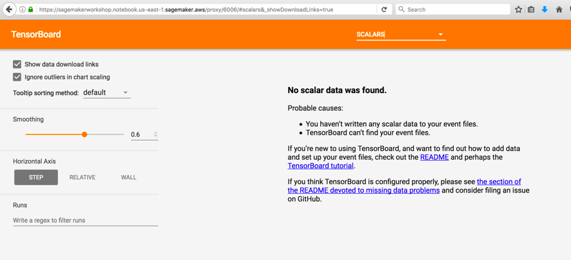

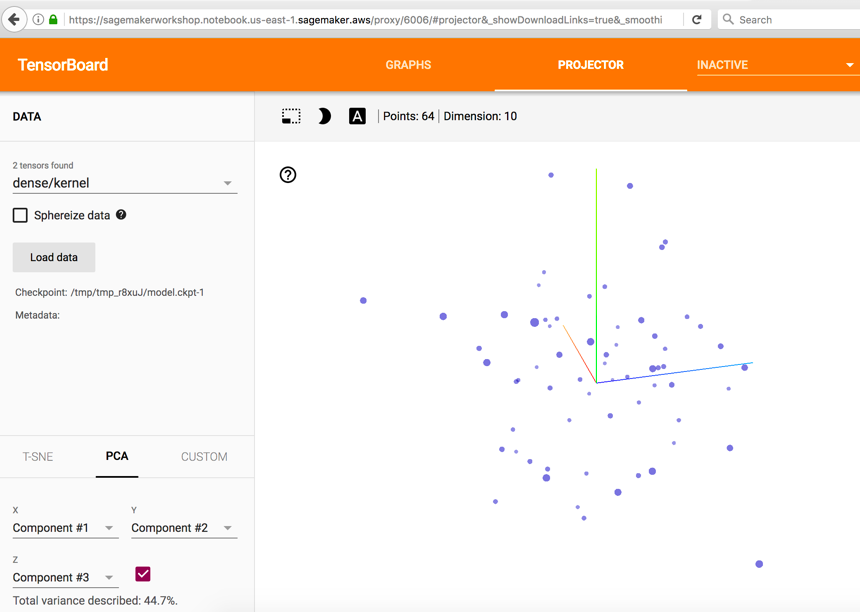

.. image:: images/lab1/pic8.png
   :target: images/lab1/pic8.png
   :alt: 

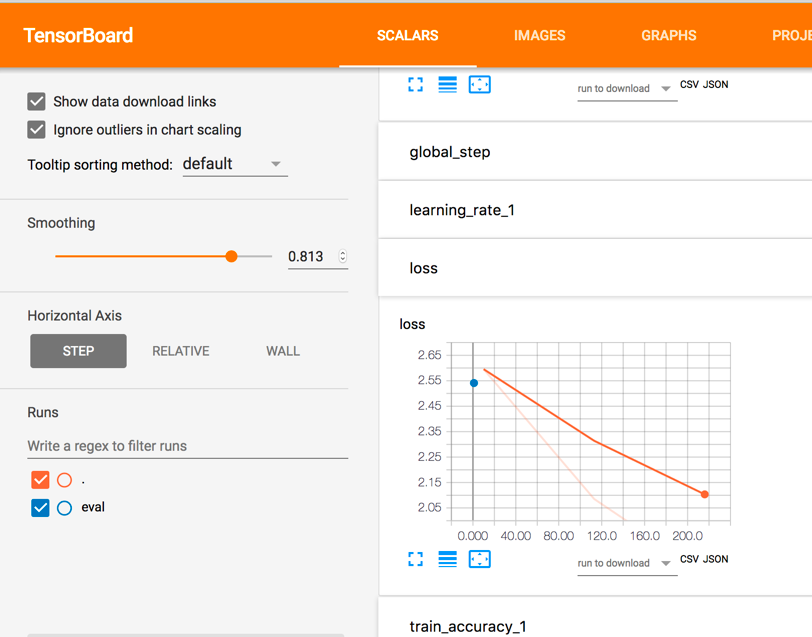

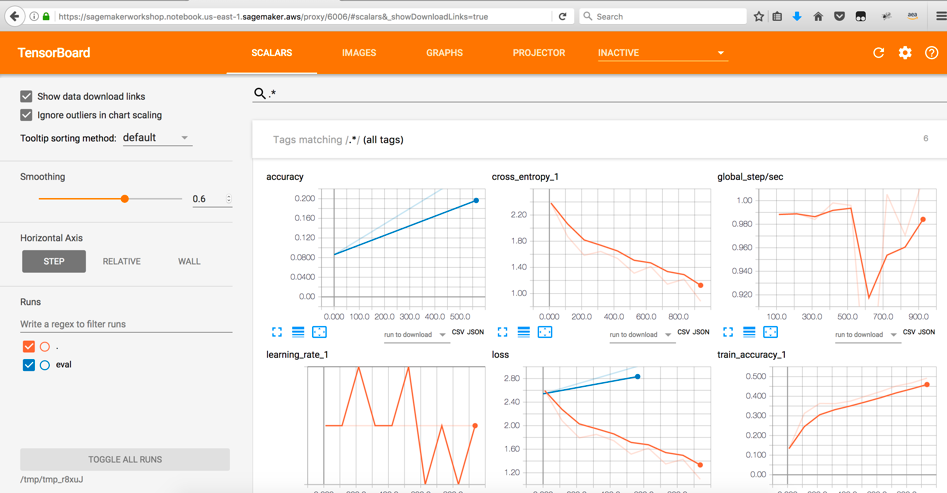

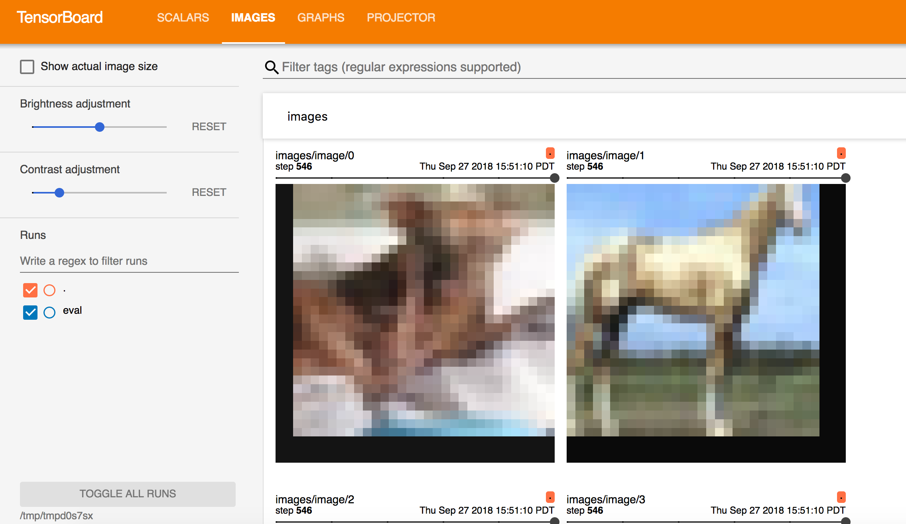

**After the training finishes (takes about 12 minutes)**  

Take a look at the logs in the container -- we can see the code right before the reading of the parameters where it prints the entire parameters dictionary:

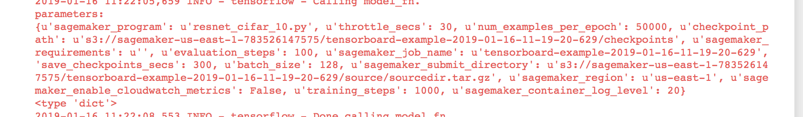

Also -- can you see where the container prints out the accuracy. This is important because when we run the HPO jobs, we have to tell it how to take a look at each of the results and know if the jobs are getting better or worst in addition to which job was the best.

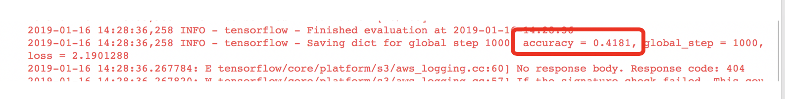

When the training finishes, finish running the rest of the code blocks that creates the predictor, runs the predict method, and deletes the predictor. Deploy a new model endpoint

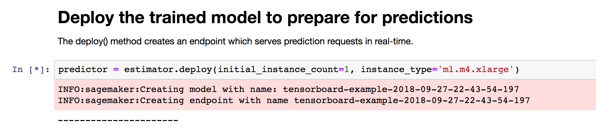

Test it:

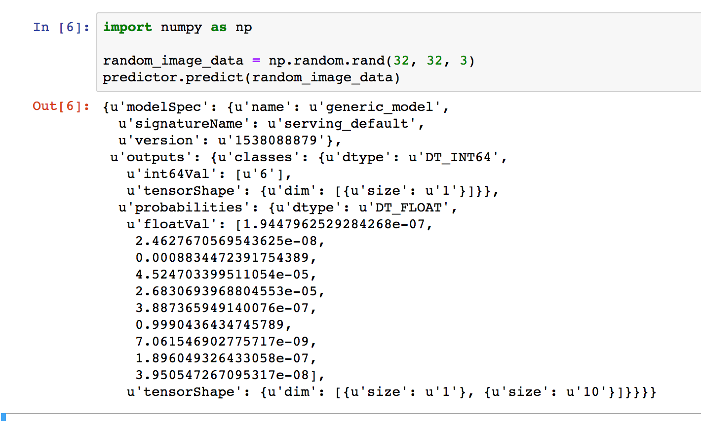

Destroy the endpoint:

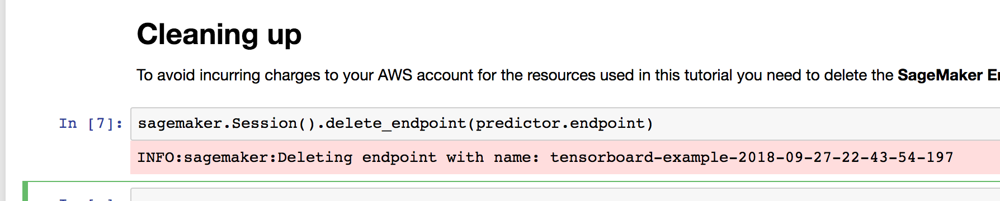

Step 2
------

HPO for TensorFlow

Hyperparameter tuning is a supervised machine learning regression problem. Given a set of input features (the hyperparameters), hyperparameter tuning optimizes a model for the metric that you choose. You can choose any metric that the algorithm you use defines. To solve a regression problem, hyperparameter tuning makes guesses about which hyperparameter combinations are likely to get the best results, and runs training jobs to test these guesses. After testing the first set of hyperparameter values, hyperparameter tuning uses regression to choose the next set of hyperparameter values to test.

Step 2
------

Creating our HPO Job

#. 
   In the next section, we'll start a HPO tuning job.

   .. image:: images/lab1/pic15.png
      :target: images/lab1/pic15.png
      :alt: 

#. 
   We can look in the SageMaker Console and see the job started under Hyperparameter Tuning Jobs

   .. image:: images/lab1/pic16.png
      :target: images/lab1/pic16.png
      :alt: 

#. 
   Executing the next two cells will print the HPO job name\ :raw-html-m2r:` `
   **NOTE: you can always pull the results using the job name** We'll also wait for the jobs to finish again:

   .. image:: images/lab1/pic17.png
      :target: images/lab1/pic17.png
      :alt: 

.. code-block::

   Dots will continue as it waits

   

   You'll see the hourglass in the tab go away and an exclamation mark when it's done.

   

Step 3
------

Evaluting the HPO Job

#. 
   We can start analyzing the results of the jobs:

   .. image:: images/lab1/pic18.png
      :target: images/lab1/pic18.png
      :alt: 

#. 
   First lets look at our training objective score over time

   .. image:: images/lab1/pic19.png
      :target: images/lab1/pic19.png
      :alt: 

#. 
   Now let's look per objective, the training objective

   .. image:: images/lab1/pic20.png
      :target: images/lab1/pic20.png
      :alt: 

   .. image:: images/lab1/pic21.png
      :target: images/lab1/pic21.png
      :alt: 

© 2018, Amazon Web Services, Inc. or its affiliates. All rights reserved.

End Of Lab, `Click to Return Home <index.html>`_

----
